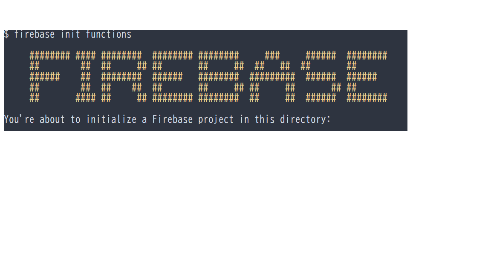

# タイピングゲーム

- [タイピングゲーム](#タイピングゲーム)
  - [プロダクトの紹介](#プロダクトの紹介)
  - [こだわった](#こだわった)
    - [見た目](#見た目)
    - [トップ画面](#トップ画面)
  - [くるしい](#くるしい)
    - [時間](#時間)
    - [オウム返ししてくれない](#オウム返ししてくれない)
  - [勉強になりました](#勉強になりました)
    - [FirebaseでNode.jsを動かしてLINE BOTを作る](#firebaseでnodejsを動かしてline-botを作る)
  - [感想](#感想)

 

## プロダクトの紹介

楽しみながらタイピングゲームができます。
経過時間がわかります。

- 野球が何試合見れたか
- ゆでたまごがなんこつくれるか
- カップラーメンがなんこつくれるか

表示します。

---

## こだわった
 
楽しみながらタイピングができるようにした。
 
 

### 見た目
- 本物のサイトを検証ツールで見ながらできる限り似せて作った。
- ダサい、昔っぽい、余計な装飾をしないようにした。
- 改行したときに、テキストエリアに反映されるようにした。

### トップ画面
- illustratorで加工した。
- モザイク感を出した。

---

## くるしい

### 時間
Firebaseに送信する時点で文字列として送信するようにした。
 

UNIXタイム、JSON形式、dateオブジェクト、dayjsオブジェクトの理解ができるようになった。
 

公式サイト
 

https://day.js.org/docs/en/installation/installation

### オウム返ししてくれない

LINEBOTに挑戦したが、上手くいかなかった。

 
かっこいい表示もできた。
 
 

  

 
 
Firebaseにデプロイし、LINEのwebbookの通信テストまでできた。
 
トーク画面で「既読」はつくが返答がない。
「401」の通信エラーが出る。
 

永遠に既読無視される。
 

学習が進んだ後に、もう1度チャレンジしたい。
 

***

## 勉強になりました
 

### FirebaseでNode.jsを動かしてLINE BOTを作る
https://qiita.com/n0bisuke/items/909881c8866e3f2ca642
 

---

## 感想
Gitbushの良い練習になった。
 
試行錯誤して、時間の計算と配列が上手く動いてくのが楽しかった。
 
LINEBOT動かせるようにしたい。
